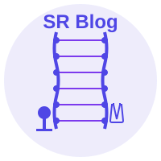
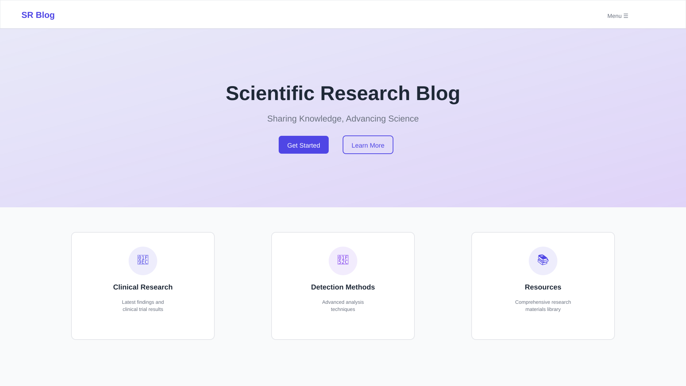
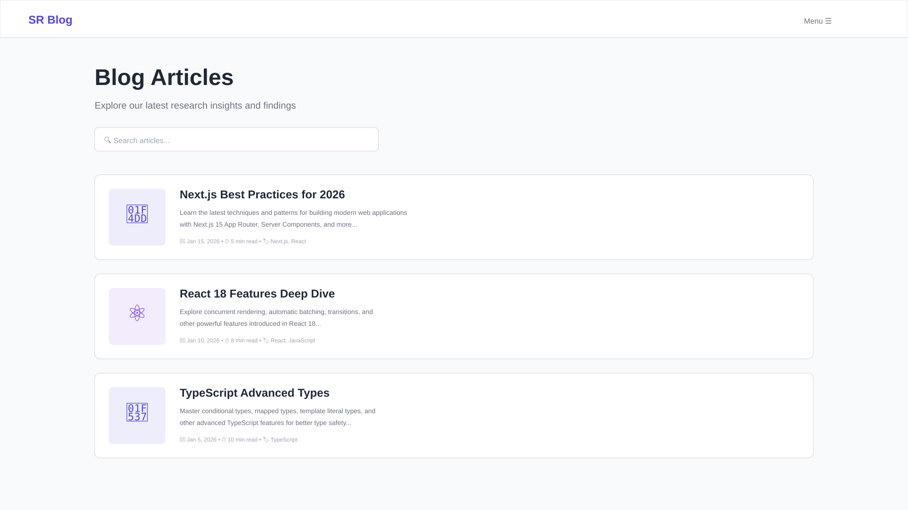
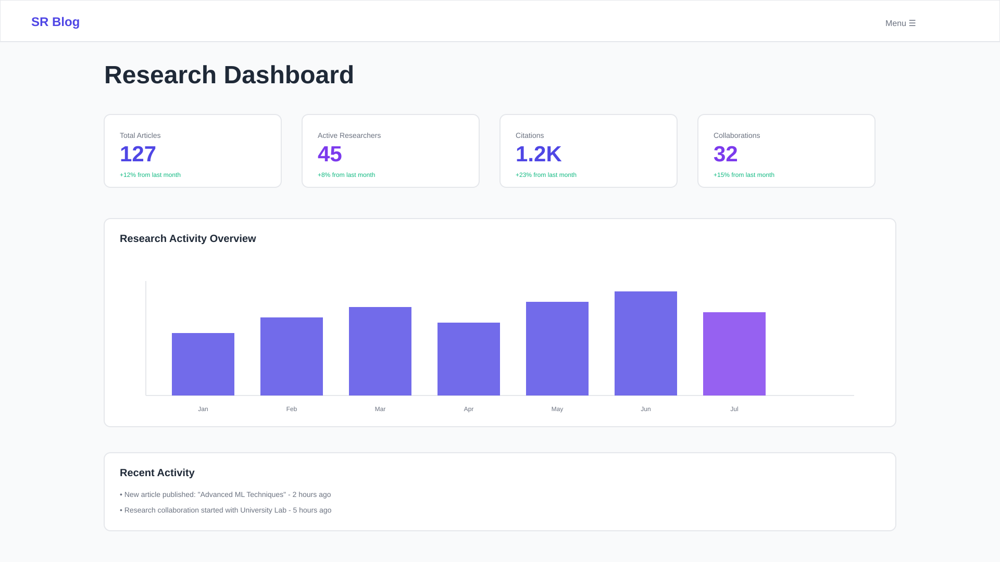

<div align="center">

# 🧬 Scientific Research Blog



**A Modern Scientific Research Blog Platform Built with Next.js 15**

[](https://nextjs.org/)
[](https://reactjs.org/)
[](https://www.typescriptlang.org/)
[](https://tailwindcss.com/)
[](LICENSE)

[📖 Documentation](./docs) · [🚀 Live Demo](#) · [🐛 Report Bug](../../issues) · [✨ Request Feature](../../issues)

</div>

---

## 📋 Table of Contents

- [✨ Features](#-features)
- [🎯 Overview](#-overview)
- [🛠️ Tech Stack](#️-tech-stack)
- [📦 Project Structure](#-project-structure)
- [🚀 Quick Start](#-quick-start)
- [📝 Content Management](#-content-management)
- [🎨 Customization](#-customization)
- [🌐 Deployment](#-deployment)
- [🤝 Contributing](#-contributing)
- [📄 License](#-license)

---

## ✨ Features

<table>
  <tr>
    <td align="center">⚡</td>
    <td><strong>Lightning Fast</strong><br/>Built with Next.js 15 App Router and Turbopack for blazing fast performance</td>
  </tr>
  <tr>
    <td align="center">📝</td>
    <td><strong>MDX Support</strong><br/>Write blog posts with MDX - Markdown with React components</td>
  </tr>
  <tr>
    <td align="center">🎨</td>
    <td><strong>Beautiful UI</strong><br/>Modern and responsive design with Tailwind CSS and shadcn/ui</td>
  </tr>
  <tr>
    <td align="center">🔍</td>
    <td><strong>SEO Optimized</strong><br/>Built-in SEO optimization for better search engine visibility</td>
  </tr>
  <tr>
    <td align="center">📱</td>
    <td><strong>Fully Responsive</strong><br/>Mobile-first design that works on all devices</td>
  </tr>
  <tr>
    <td align="center">🧪</td>
    <td><strong>Research Focused</strong><br/>Specialized sections for clinical studies, detection methods, and training resources</td>
  </tr>
</table>

---

## 🎯 Overview

**Scientific Research Blog** is a modern, full-featured blog platform designed specifically for scientific research communities. It provides a comprehensive solution for sharing research findings, clinical studies, detection methodologies, and training resources.

### Key Highlights

- 🏥 **Clinical Research**: Dedicated section for clinical trial results and medical research
- 🔬 **Detection Methods**: Showcase various detection and analysis techniques
- 📚 **Resource Library**: Comprehensive repository of research materials and guidelines
- 👥 **Community Driven**: Built-in community features for researcher collaboration
- 🎓 **Training Hub**: Educational resources and training materials

---

## 🛠️ Tech Stack

<div align="center">

| Category | Technologies |
|----------|-------------|
| **Framework** |  |
| **Language** |  |
| **UI Library** |  |
| **Styling** |  |
| **Components** |  |
| **Content** |  |
| **Code Quality** |   |
| **Deployment** |  |

</div>

### Core Dependencies

```json
{
  "next": "^15.3.2",
  "react": "^18.3.1",
  "@mdx-js/react": "^3.1.1",
  "tailwindcss": "^3.4.17",
  "lucide-react": "^0.544.0"
}
```

---

## 📦 Project Structure

```
scientific-research-blog/
│
├── 📁 src/
│   ├── 📁 app/                    # Next.js App Router pages
│   │   ├── layout.tsx             # Root layout with global providers
│   │   ├── page.tsx               # Homepage
│   │   ├── 📁 blog/               # Blog section
│   │   │   ├── page.tsx           # Blog list page
│   │   │   ├── BlogList.tsx       # Blog list component
│   │   │   └── [slug]/            # Dynamic blog post pages
│   │   ├── 📁 clinical/           # Clinical research section
│   │   ├── 📁 detection/          # Detection methods section
│   │   ├── 📁 research/           # Research articles section
│   │   ├── 📁 training/           # Training resources section
│   │   ├── 📁 community/          # Community features
│   │   ├── 📁 resources/          # Resource library
│   │   └── 📁 api/                # API routes
│   │
│   ├── 📁 components/             # React components
│   │   ├── Header.tsx             # Navigation header
│   │   ├── Footer.tsx             # Site footer
│   │   ├── HeroSection.tsx        # Landing hero section
│   │   ├── FeatureSection.tsx     # Features showcase
│   │   ├── MDXContent.tsx         # MDX content renderer
│   │   ├── ShareButton.tsx        # Social sharing buttons
│   │   └── 📁 ui/                 # shadcn/ui components
│   │
│   └── 📁 lib/                    # Utility functions
│       ├── mdx.ts                 # MDX processing utilities
│       └── utils.ts               # Helper functions
│
├── 📁 content/                    # Content files
│   └── 📁 blog/                   # MDX blog posts
│       ├── nextjs-best-practices.mdx
│       ├── react-18-features.mdx
│       └── typescript-advanced-types.mdx
│
├── 📁 public/                     # Static assets
│   └── 📁 images/                 # Image files
│
├── 📄 next.config.js              # Next.js configuration
├── 📄 tailwind.config.ts          # Tailwind CSS configuration
├── 📄 tsconfig.json               # TypeScript configuration
├── 📄 package.json                # Project dependencies
└── 📄 README.md                   # This file
```

---

## 🚀 Quick Start

### Prerequisites

Make sure you have the following installed:

- **Node.js** 18.x or higher
- **Bun** (recommended) or npm/yarn/pnpm

### Installation

1️⃣ **Clone the repository**

```bash
git clone https://github.com/yourusername/scientific-research-blog.git
cd scientific-research-blog
```

2️⃣ **Install dependencies**

```bash
# Using Bun (recommended)
bun install

# Or using npm
npm install

# Or using yarn
yarn install

# Or using pnpm
pnpm install
```

3️⃣ **Run the development server**

```bash
# Using Bun
bun dev

# Or using npm
npm run dev

# Or using yarn
yarn dev

# Or using pnpm
pnpm dev
```

4️⃣ **Open your browser**

Navigate to [http://localhost:3000](http://localhost:3000) to see your application running! 🎉

### Build for Production

```bash
# Build the application
bun run build

# Start the production server
bun start
```

---

## 📝 Content Management

### Creating a New Blog Post

1. Create a new `.mdx` file in the `content/blog/` directory:

```mdx
---
title: "Your Amazing Post Title"
description: "A brief description of your post"
date: "2026-02-01"
author: "Your Name"
tags: ["research", "science", "innovation"]
---

# Your Content Here

Write your content using Markdown and React components!

<CustomComponent prop="value" />
```

2. The post will automatically appear in your blog list!

### Supported Features

- ✅ Syntax highlighting for code blocks
- ✅ GitHub Flavored Markdown
- ✅ React components in MDX
- ✅ Automatic table of contents
- ✅ Image optimization
- ✅ Custom styling

---

## 🎨 Customization

### Styling

The project uses **Tailwind CSS** for styling. Customize your theme in:

```typescript
// tailwind.config.ts
export default {
  theme: {
    extend: {
      colors: {
        // Add your custom colors
      },
    },
  },
}
```

### Components

All UI components are based on **shadcn/ui**. Add new components:

```bash
bunx shadcn@latest add [component-name]
```

### Configuration

- **Next.js**: `next.config.js`
- **TypeScript**: `tsconfig.json`
- **ESLint**: `eslint.config.mjs`
- **Biome**: `biome.json`

---

## 🌐 Deployment

### Deploy to Netlify

This project is configured for Netlify deployment:

[](https://app.netlify.com/start/deploy?repository=https://github.com/yourusername/scientific-research-blog)

Configuration is already set in `netlify.toml`.

### Deploy to Vercel

The easiest way to deploy is using [Vercel](https://vercel.com):

[](https://vercel.com/new/clone?repository-url=https://github.com/yourusername/scientific-research-blog)

### Other Platforms

You can also deploy to:
- 🐳 Docker
- ☁️ AWS
- 🔷 Azure
- 🔴 DigitalOcean

---

## 🤝 Contributing

We welcome contributions from the community! Here's how you can help:

### Contribution Steps

1. **Fork the repository**
2. **Create a feature branch** (`git checkout -b feature/AmazingFeature`)
3. **Commit your changes** (`git commit -m 'Add some AmazingFeature'`)
4. **Push to the branch** (`git push origin feature/AmazingFeature`)
5. **Open a Pull Request**

### Code Style

- Follow the existing code style
- Run `bun run lint` before committing
- Run `bun run format` to format code

### Reporting Issues

Found a bug? Have a suggestion? [Open an issue](../../issues/new)!

---

## 📸 Screenshots

<div align="center">

### Homepage


### Blog Section


### Research Dashboard


</div>

---

## 📊 Performance

<div align="center">

| Metric | Score |
|--------|-------|
| Performance | 🟢 95+ |
| Accessibility | 🟢 100 |
| Best Practices | 🟢 100 |
| SEO | 🟢 100 |

*Lighthouse scores for production build*

</div>

---

## 🗺️ Roadmap

- [x] Basic blog functionality
- [x] MDX support
- [x] Responsive design
- [ ] Search functionality
- [ ] User authentication
- [ ] Comment system
- [ ] Dark mode
- [ ] Multi-language support
- [ ] RSS feed
- [ ] Newsletter integration

---

## 👥 Authors

**Your Name** - *Initial work*

See the list of [contributors](../../contributors) who participated in this project.

---

## 🙏 Acknowledgments

- [Next.js](https://nextjs.org/) - The React framework
- [shadcn/ui](https://ui.shadcn.com/) - Beautiful UI components
- [Tailwind CSS](https://tailwindcss.com/) - Utility-first CSS
- [Vercel](https://vercel.com/) - Hosting platform
- All contributors and supporters

---

## 📄 License

This project is licensed under the MIT License - see the [LICENSE](LICENSE) file for details.

---

## 📞 Contact & Support

- 📧 Email: mrsong96sy@outlook.com
- 🐦 Twitter: [@yourusername](https://twitter.com/yourusername)
- 💼 LinkedIn: [Your Profile](https://linkedin.com/in/yourprofile)
- 🌐 Website: [your-website.com](https://your-website.com)

---

<div align="center">

**⭐ Star this repo if you find it helpful!**

Made with ❤️ by the Scientific Research Community

[⬆ Back to Top](#-scientific-research-blog)

</div>
